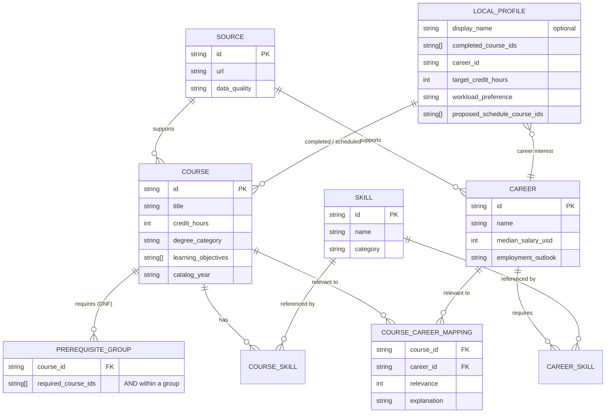
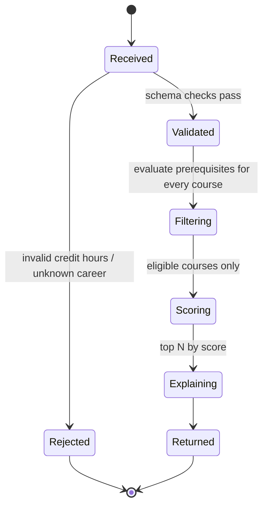
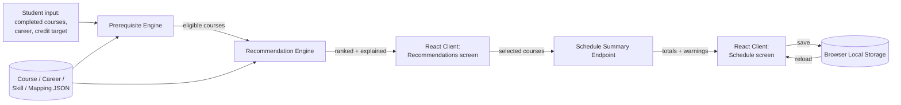

# Analysis Model

## Data model

`PREREQUISITE_GROUP` is represented in the JSON data as a list of
AND-groups per course (disjunctive normal form) rather than a separate
table — see `app/prerequisites.py` for the evaluation logic. `LOCAL_PROFILE`
lives entirely in browser local storage (ADR 0001) and is never
persisted by the backend.

## Behavior: recommendation request lifecycle

## Data flow: end-to-end MVP flow (UC-01 + UC-02)

This mirrors Figure 1 (System-Level Architecture) in the project brief:
the React client and FastAPI back end never store student data
server-side — only the curated JSON reference data is server-side and
read-only at runtime.
