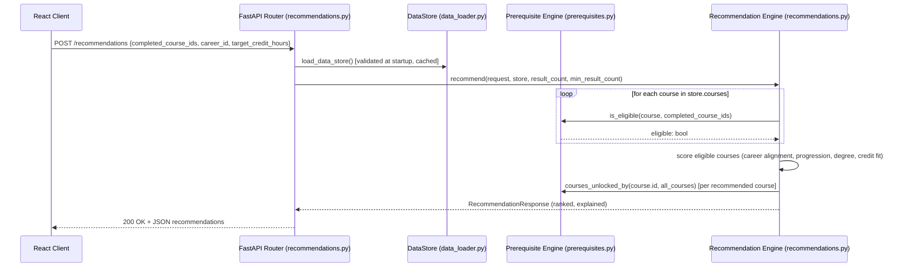
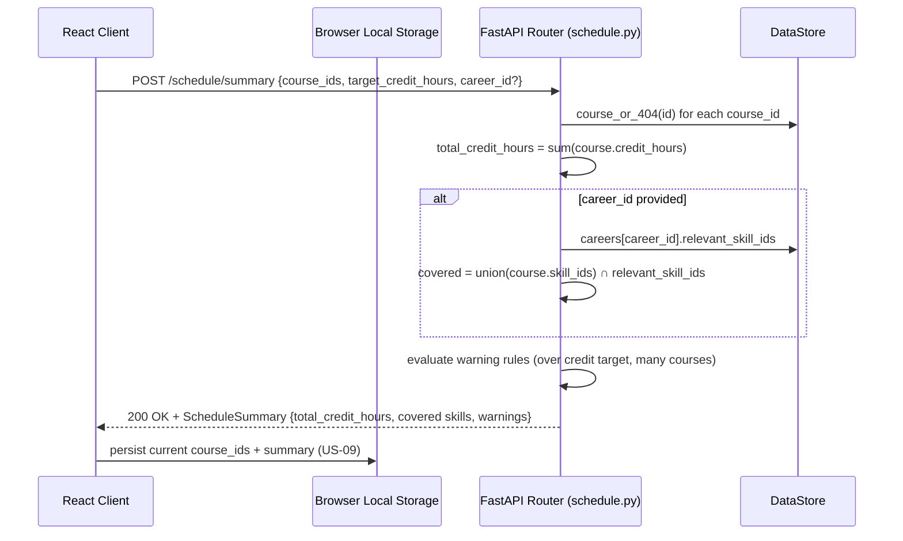

# Component Design

## Component design for UC-01: Receive Career-Aligned Course Recommendations

**Responsibilities:**
- `recommendations.py` (router): validates the HTTP request shape via
  `RecommendationRequest`, translates a `KeyError` (unknown career) into
  a 404, otherwise delegates entirely to the engine.
- `app/recommendations.py` (engine): pure business logic, no HTTP or
  JSON-file concerns — testable in isolation (see
  `tests/test_recommendations.py`).
- `app/prerequisites.py`: single source of truth for "is this course
  eligible" and "what does this course unlock," reused by both the
  recommendation engine and the standalone `/eligibility` and
  `/courses/{id}/unlocks` endpoints (UC-03).
- `data_loader.py`: the only module that touches the filesystem/JSON;
  everything else depends on the in-memory `DataStore`.

## Component design for UC-02: Build and Validate a Proposed Semester Schedule

**Responsibilities:**
- The backend is stateless per request — it recalculates the summary
  from the course IDs the client sends every time. This matches the
  architecture decision that student planning state lives in the
  browser (ADR 0001), not the backend.
- Warning rules are isolated as named constants/functions in
  `schedule.py` so the credit-target and course-count thresholds can be
  tuned without touching the request/response shape.
- The client owns persistence (`Storage` in the diagram); the backend
  never sees or stores a student's saved profile.
