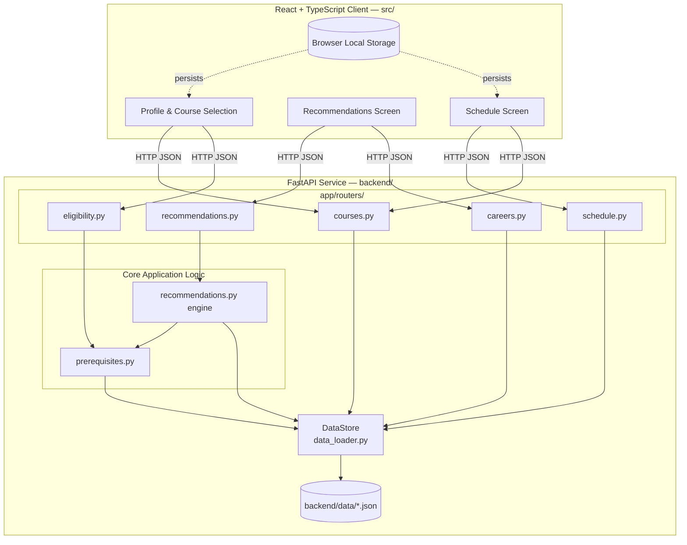

# Design Classes, API Contract, and Module Boundaries

## Design classes (backend)

| Class | Location | Role |
|---|---|---|
| `Course`, `Career` | `app/schemas.py` | Immutable data-transfer objects; also the JSON validation schema (FR-01). |
| `EligibilityRequest` / `EligibilityResult` | `app/schemas.py` | Request/response contract for `/eligibility`. |
| `RecommendationRequest` / `RecommendationItem` / `RecommendationResponse` / `RecommendationExplanation` | `app/schemas.py` | Request/response contract for `/recommendations`; `RecommendationExplanation` is the object that satisfies US-07's "explain every recommendation" requirement. |
| `ScheduleRequest` / `ScheduleSummary` / `ScheduleWarning` | `app/schemas.py` | Request/response contract for `/schedule/summary`. |
| `DataStore` | `app/data_loader.py` | In-memory repository over the validated JSON dataset; the only class other modules use to read course/career data. |
| Prerequisite engine functions (`is_eligible`, `missing_prerequisites`, `courses_unlocked_by`, `evaluate`) | `app/prerequisites.py` | Stateless functions operating on a `Course` and a set of completed IDs — kept as functions, not a class, since they hold no state (see "Design Patterns" below). |
| Recommendation engine functions (`recommend`, `_score_course`, `_explain`) | `app/recommendations.py` | Stateless scoring/explanation logic over a `DataStore` and a `RecommendationRequest`. |

## API / interface contract

All endpoints are served by the FastAPI app in `app/main.py` and are
also documented interactively at `/docs` once the server is running
(FastAPI generates this from the same Pydantic schemas listed above, so
the two never drift apart).

| Method | Path | Request body | Response | Notes |
|---|---|---|---|---|
| GET | `/health` | — | `{"status": "ok"}` | Liveness check |
| GET | `/courses` | — | `Course[]` | US-02 |
| GET | `/courses/{id}` | — | `Course` | 404 if unknown |
| GET | `/courses/{id}/unlocks` | — | `string[]` | US-12 |
| POST | `/courses/compare` | `CompareRequest` | `Course[]` | US-10, 1–3 IDs |
| GET | `/careers` | — | `Career[]` | US-03, US-11 |
| GET | `/careers/{id}` | — | `Career` | 404 if unknown |
| POST | `/eligibility` | `EligibilityRequest` | `EligibilityResult[]` | US-05 |
| POST | `/recommendations` | `RecommendationRequest` | `RecommendationResponse` | US-06, US-07 |
| POST | `/schedule/summary` | `ScheduleRequest` | `ScheduleSummary` | US-08 |

No endpoint requires authentication: the MVP has no accounts (see MVP
Scope — passwords and email-based accounts are explicitly excluded).

## Module boundary diagram

The dashed lines show that local storage is a *client-only* boundary —
no backend module reads or writes it, matching ADR 0001.

## Design patterns used, and why

1. **Repository pattern (`DataStore`).** All reference-data access goes
   through one class with a small, explicit interface
   (`course_or_404`, `mappings_for_career`, plus the `courses`/`careers`
   dicts). Routers and the recommendation engine never touch JSON files
   or file paths directly. This means the data source can change (e.g.
   to SQLite, per ADR 0001's "revisit when" note) by rewriting
   `data_loader.py` alone — no other module needs to change.

2. **Dependency Injection via FastAPI's `Depends`.** Every router
   receives its `DataStore` through `Depends(load_data_store)` rather
   than importing a global. Combined with `lru_cache` this gives a
   single shared, validated instance per process, while still letting
   tests substitute a different `DATA_DIR` and call `reset_cache()` to
   load an alternate dataset without monkey-patching internals.

Both patterns were chosen because the team is small and the MVP dataset
is simple: they add just enough structure to keep the data-access layer
swappable and testable without introducing a full ORM or a plugin
architecture the project doesn't need yet.
